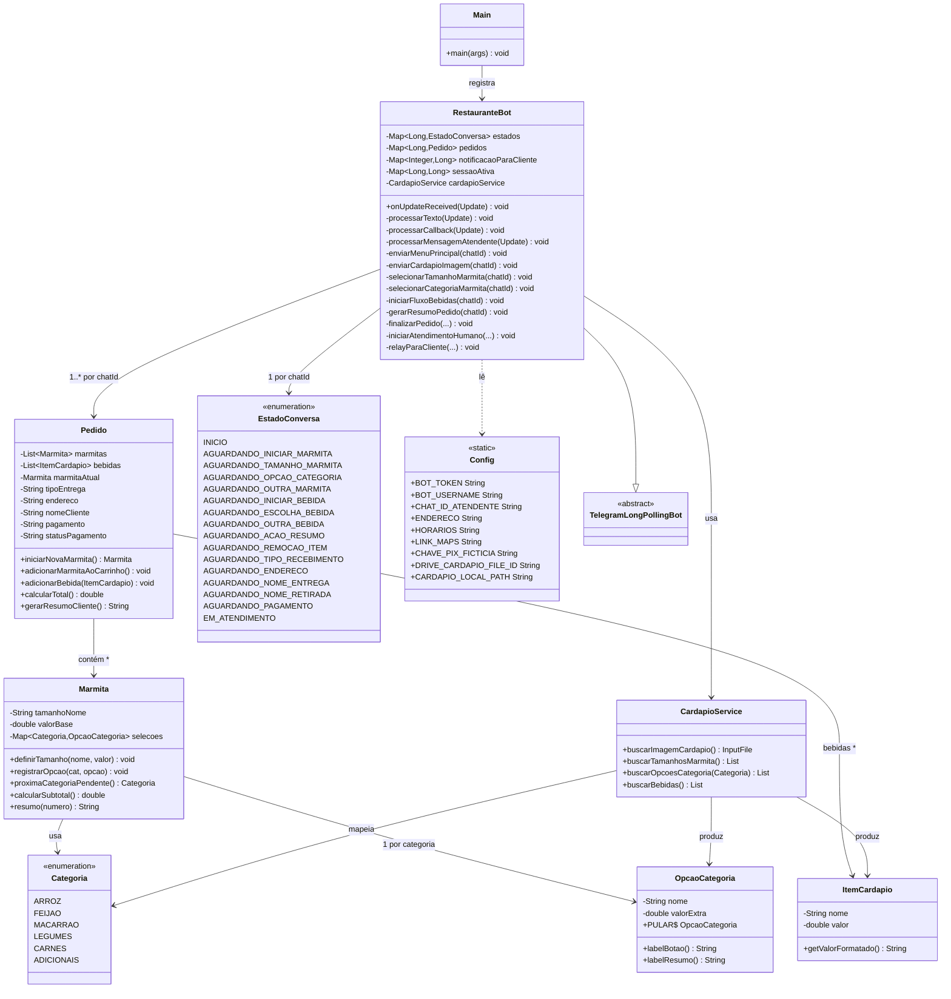
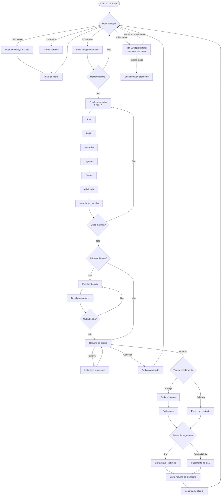
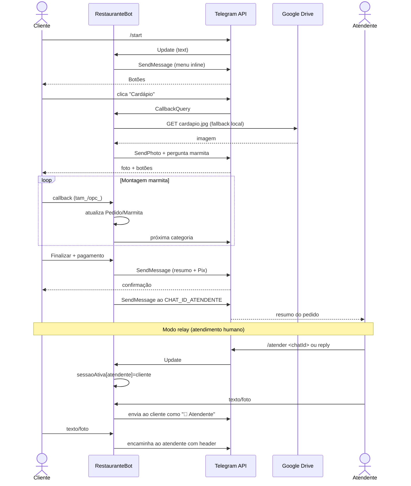

# Diagramas do Bot do Restaurante

Diagramas em Mermaid refletindo o estado atual do código em `src/main/java/com/restaurantebot/`.

## Arquitetura de Classes

## Fluxo de Conversa

## Comunicação com Telegram

